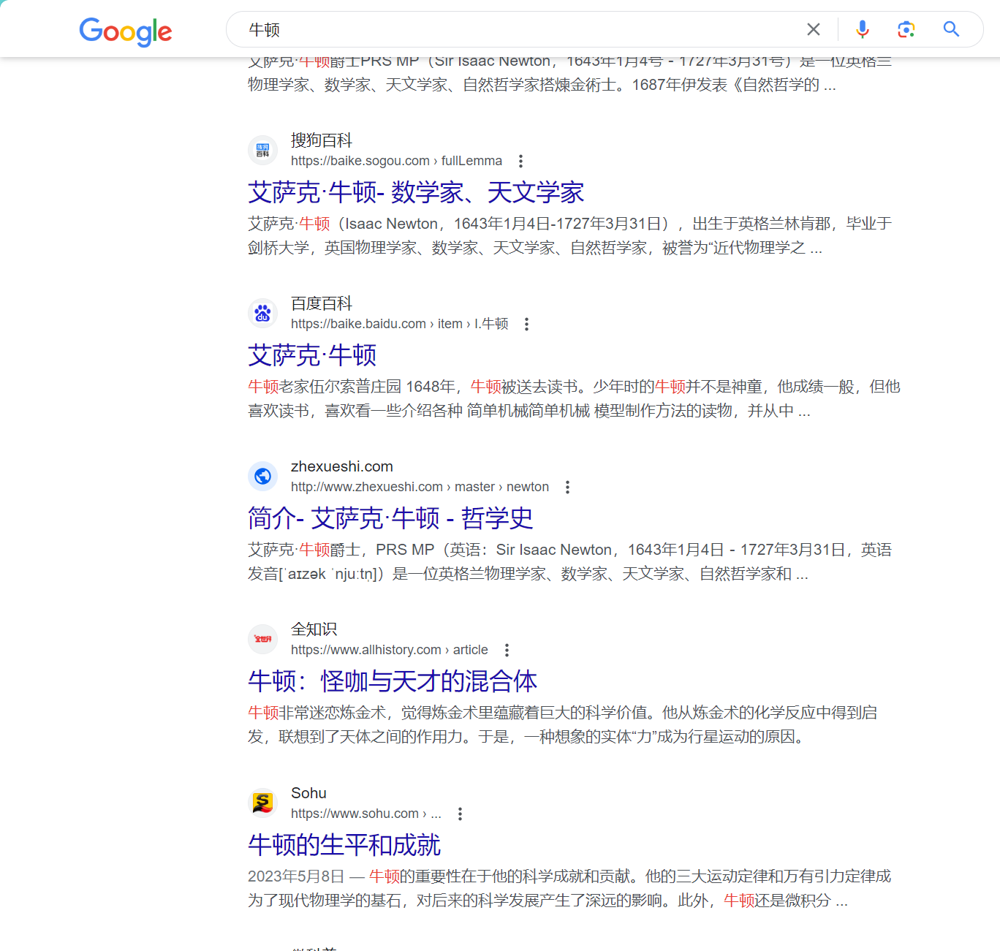
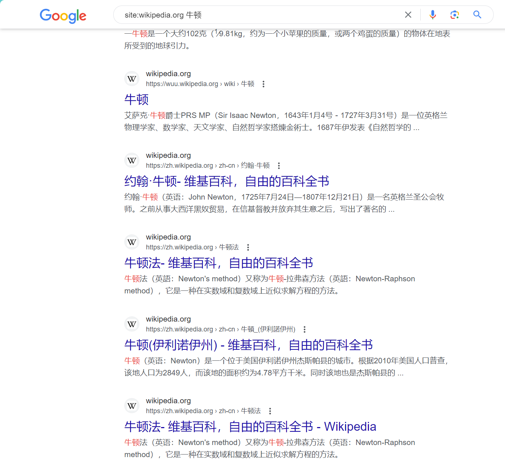
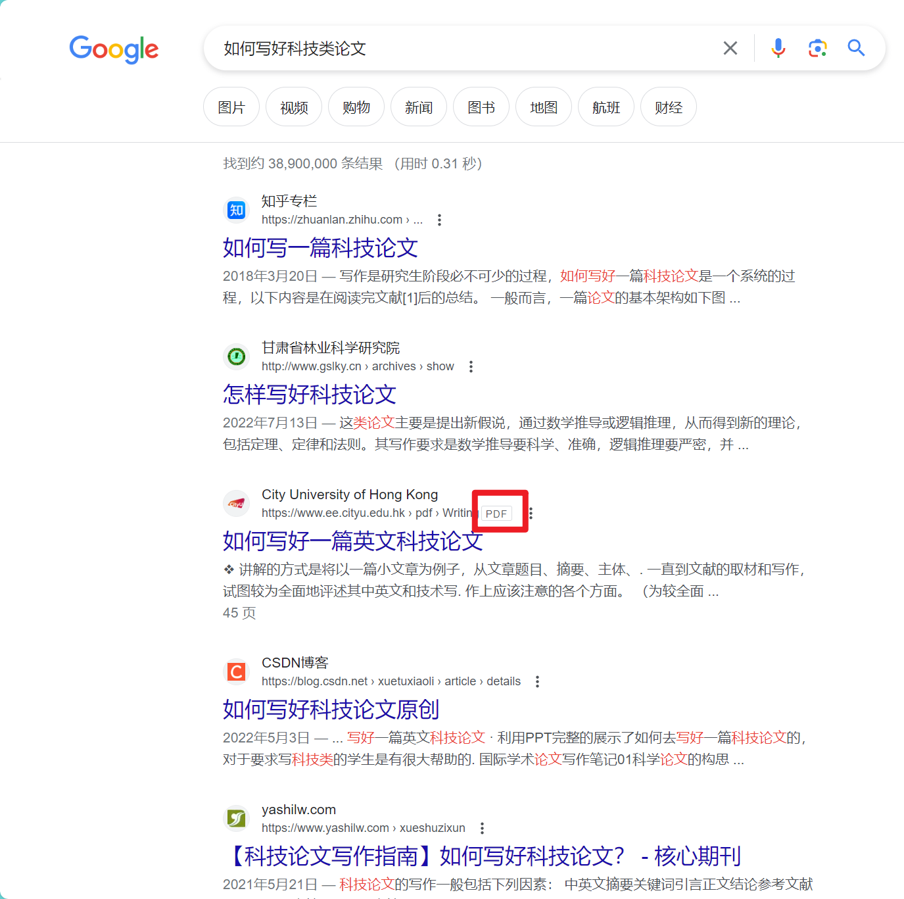
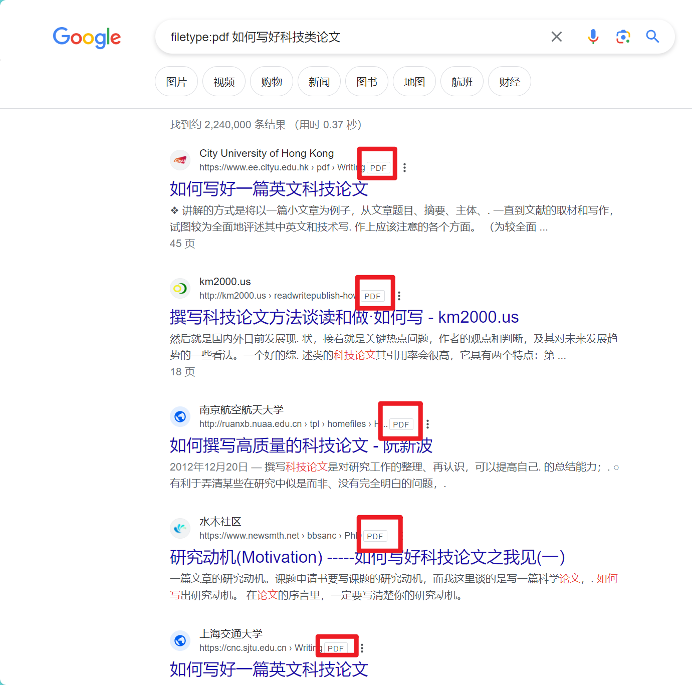
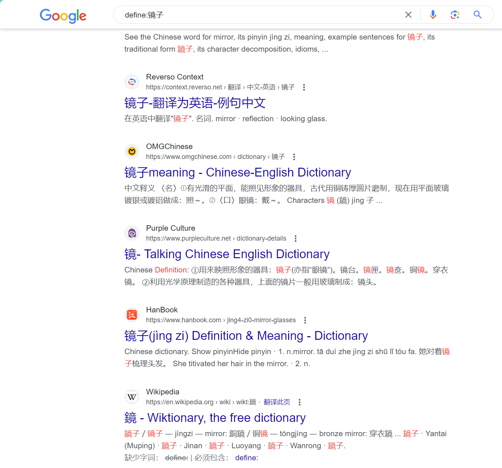
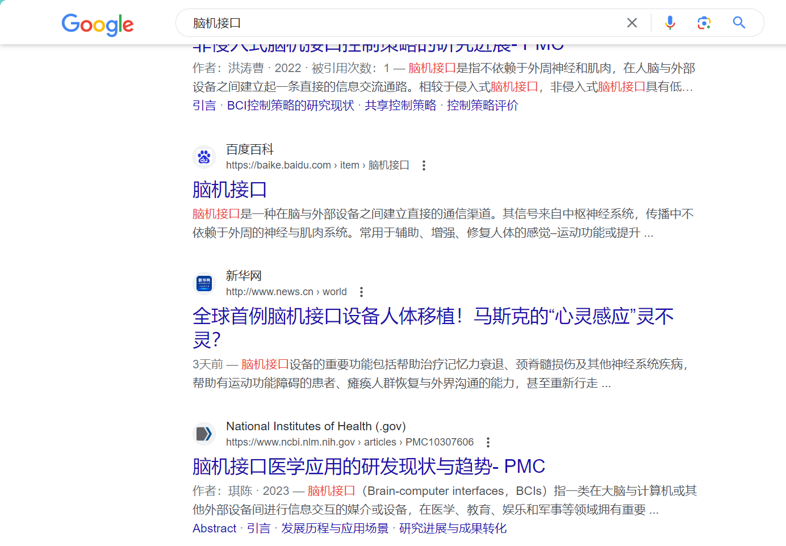

# 高效使用搜索引擎（以Google为例）

## 1.短语匹配（精确搜索）

使用**英文双引号**将短语括起来，以确保搜索结果包含完整的短语，搜索的结果里面一定会包含这个词，不会拆分开，甚至标点或词的顺序都会保持一致。

```cmd
"瑞芯微1808"
```

我们感受一下加双引号前后的准确搜索效率：


## 2.排除词（排除关键字）

使用减号 `-` 来排除包含特定词汇的结果。

```cmd
外星人 -电脑
```

在上面的搜索提示词中，`外星人`这个名词是一款很高档的笔记本电脑品牌，而我们只想搜索到有关真正的`外星人`相关而不是`外星人笔记本电脑`的内容，因此我们使用减号排除`电脑`这个关键字，下面我们对比一下使用排除词前后的搜索效率：


## 3.限定搜索范围

使用 `site:` 运算符限定搜索结果在特定网站中。

```cmd
site:wikipedia.org 牛顿
```

该提示词表示，我只在维基百科中搜索有关`牛顿`的信息，这样搜索就不会出现其他网站的结果（含有关键字”牛顿“），我们看一下搜索效果：





## 4.指定文件类型

使用 `filetype:` 指定搜索结果为特定文件类型。

```cmd
filetype:pdf 如何写好科技类论文
```

上述提示词表示，我要搜索`如何写好科技类论文`相关的内容，但是搜出来的结果必须是PDF文档，否则不要。我们看一下使用前后的搜索效果：






## 5.定义词义

使用 `define:` 获取特定词汇的定义。

```
define:镜子
```

以上提示词表示搜索镜子的有关定义，而不是其他内容，我们看一下使用前后相关搜索结果：





## 6.全文搜索

使用 `intext:` 查找包含特定文本的页面。

```
intext:"脑机接口"
```

使用该语法将会返回包含确切短语“脑机接口”的文档。这意味着搜索引擎只会返回在文档正文中包含这个短语的结果，而不是在标题、链接或其他地方出现的结果。




## 7.组合使用

可以组合多个运算符和关键词以创建更复杂的查询。

```
site:arxiv.org "action recognition" -GCN
```

在这样的组合下，搜索结果只会出现arxiv网站的内容，而且有关action recognition的文章，不能包含GCN关键字，也就是说这个动作识别算法不能用到图卷积神经网络。


这些是一些准确搜索的基本用法，通过灵活运用这些技巧，可以更有效地找到所需的信息。